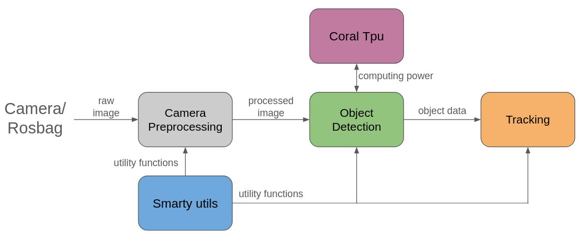

# Tracking

The **Object Tracking Node** tracks detected objects, traffic signs, and intersection lane markings over time, providing stable track IDs and velocity estimates to the planner.

Internally, two or three independent Kalman filter-based trackers run in parallel (SORT architecture: Predict → Associate → Update → Create/Delete). Incoming detections are associated with existing tracks using **Mahalanobis distance** gating and the Hungarian algorithm. All confirmed tracks are bundled into a single state topic. The crossing tracker can be disabled via `crossing_tracking_enabled: false`.

---

## Requirements
- Ros 2 Jazzy installation according to [Smartrollerz .dotfiles](https://github.com/DHBW-Smart-Rollerz/.dotfiles)
- [Smarty utils](https://github.com/DHBW-Smart-Rollerz/smarty_utils)
- [Camera Preprocessing](https://github.com/DHBW-Smart-Rollerz/camera_preprocessing)
- [Object detection](https://github.com/DHBW-Smart-Rollerz/object_detection)
- Google Coral TPU (never directly used in Tracking but required for detection), can be found in the SmartRollerz lab
- PyCoral (Run the [install_pycoral.sh](https://github.com/DHBW-Smart-Rollerz/object_detection/blob/jazzy/install_pycoral.sh) script that is provided by the object detection)
> **_NOTE:_** There're no further Python packages required. All packages that are used are already required by Smarty utils or object detection

---

## Running
1. Rosbags are recordings of test drives with the vehicle. They are used for testing on your Laptop and can be found on the [NAS](https://it-nas.dhbw-stuttgart.de:5001/?launchApp=SYNO.SDS.Drive.Application#file_id=853344289158117985). 
This is how you play the recording:
```
$ ros2 bag play [name of your bag]
```
> **_NOTE:_** Please check the [official Ros 2 Jazzy documentation](https://docs.ros.org/en/jazzy/Tutorials/Beginner-CLI-Tools/Recording-And-Playing-Back-Data/Recording-And-Playing-Back-Data.html#play-topic-data) for further options.

2. Run the camera_preprocessing node:
```
$ ros2 launch camera_preprocessing camera_preprocessing.launch.py 
```

3. Run the object_detection node:
```
$ ros2 launch object_detection object_detection.launch.py
```

4. Run your tracking node:
```
$ ros2 launch tracking object_tracking.launch.py
```
This image might give you a better understanding how the tracking is set in the ecosystem.


In case you want to see a visual representation of the tracking output, you can run the visualization node:
```
$ ros2 run tracking tracking_visualization_node
```
Just like the visual outputs of the camera preprocessing and the object detection, it can be viewed in rviz:
```
$ ros2 run rviz2 rviz2
```

---

## Interfaces (Input & Output)

### 1. Input (Subscribed Topics)

| Topic | Message Type | Source |
|---|---|---|
| `/object_detection/object` | `Float32MultiArray` | Moving objects (vehicles, pedestrians) |
| `/object_detection/sign` | `Float32MultiArray` | Traffic signs |
| `/crossing_detection/result` | `Float32MultiArray` | Intersection lane markings *(only if `crossing_tracking_enabled: true`)* |

**Detection data structure (flattened array, 6 values per detection):**
```text
[Class_ID, BL_x, BL_y, BR_x, BR_y, Score]
```

| Field | Description |
|---|---|
| `Class_ID` | Object class (int) |
| `BL_x / BL_y` | Bottom-left coordinate (mm, vehicle frame) |
| `BR_x / BR_y` | Bottom-right coordinate (mm, vehicle frame) |
| `Score` | Detection confidence (0.0 – 1.0) |

---

### 2. Output (Published Topic)

| Topic | Message Type |
|---|---|
| `/tracking/state` | `state_msgs/State` |

The message contains an array of `TrackedObject` entries (all three trackers bundled):

| Field | Type | Description |
|---|---|---|
| `tracked_id` | `uint32` | Stable track ID over time |
| `class_id` | `uint8` | Object class |
| `position_x` | `float32` | x-position (mm, vehicle frame) |
| `position_y` | `float32` | y-position (mm, vehicle frame) |
| `velocity_x` | `float32` | Velocity in x (mm/s) |
| `velocity_y` | `float32` | Velocity in y (mm/s) |
| `confidence` | `float32` | Tracking confidence (0.0 – 1.0) |
| `width` | `float32` | Object width (mm) |

---

### 3. Track ID Ranges and Object Classes

Each object has 2 IDs: The **Class ID** identifies the class an object belongs to (e.g. car, pedestrian) while the **Track ID** is distinct for each object that ist tracked and is used to recognize known objects. Track IDs are partitioned by tracker:

| Range | Tracker | Input Topic |
|---|---|---|
| 0 – 9999 | Object Tracker | `/object_detection/object` |
| 10000 – 19999 | Sign Tracker | `/object_detection/sign` |
| 20000+ | Crossing Tracker | `/crossing_detection/result` |

Class IDs represent the following objects and signs:

#### Object Tracker

| Class ID | Label |
|---|---|
| **2** | Vehicle |
| **10** | Pedestrian |

#### Sign Tracker

| Class ID | Label |
|---|---|
| **1** | Stop sign |
| **3** | No overtaking |
| **4** | No overtaking lifted |
| **5** | Fast track |
| **6** | Fast track lifted |
| **7** | Speed limit 30 |
| **8** | Speed limit 30 lifted |
| **9** | Crosswalk |
| **13** | Priority for oncoming traffic |
| **14** | Parking |
| **15** | Turn left |
| **16** | Turn right |
| **17** | Give way |
| **18** | Priority road |
| **19** | Pedestrian island |

#### Crossing Tracker

| Class ID | Label |
|---|---|
| **20** | Ego lane — solid |
| **21** | Ego lane — dotted |
| **22** | Opposing lane — solid |
| **23** | Opposing lane — dotted |
| **24** | Right lane — solid |
| **25** | Right lane — dotted |
| **26** | Left lane — solid |
| **27** | Left lane — dotted |

---

## Parameters

All parameters are configured in [`config/tracking_params.yaml`](config/tracking_params.yaml).

### General Parameters

| Parameter | Default | Description |
|---|---|---|
| `publish_interval_ms` | 15 | State publisher frequency (ms) |
| `tracker_step_interval_ms` | 40 | Minimum interval (ms) for a timer-triggered predict step when no detection arrives |
| `max_x` | 3000 | Maximum valid x-position (mm) — tracks outside this range are deleted |
| `max_y` | 2000 | Maximum valid y-position (mm) |
| `crossing_tracking_enabled` | true | Enable/disable the crossing tracker; set to `false` to skip crossing detection entirely |

### Per-Tracker Parameters (prefix: `object_` / `sign_` / `crossing_`)

| Parameter | Description |
|---|---|
| `max_age` | Maximum tracker frames without a measurement update before a track is deleted |
| `min_hits` | Minimum number of successful measurement updates required to confirm a track |
| `min_age` | Minimum number of tracker frames required to confirm a track |
| `max_distance` | Mahalanobis distance gate for detection-to-track association (chi² distance) |
| `q_pos` | Process noise for position (mm) — higher = model is trusted less, predictions spread faster |
| `q_vel` | Process noise for velocity (mm/s) — higher = larger velocity changes are expected |
| `r_pos` | Measurement noise for position (mm) at the reference distance — higher = measurements are trusted less |
| `r_dist_ref` | Reference distance (mm) for measurement noise scaling — `r_pos` applies exactly at this distance, scaling linearly with distance |
| `sigma_pos_init` | Initial position uncertainty when creating a new track (mm) |
| `sigma_vel_init` | Initial velocity uncertainty when creating a new track (mm/s) |

> **Note on `max_distance`:** A value of 3.03 corresponds to the chi² 99% confidence interval (2 DoF). Higher values allow more generous association and reduce track fragmentation, but increase the risk of incorrect matches.

---

## Coordinate System

- **Units:** All positions and velocities in **millimeters (mm)** and **mm/s**
- **Origin:** Vehicle-relative frame (as received from the detection node)
- **No ego-motion compensation:** Since no ego-velocity is available, signs appear to move in the vehicle frame when the vehicle drives past them

---

## Debugging

```bash
# Check tracker output (are IDs stable? do positions change plausibly?)
ros2 topic echo /tracking/state

# Check whether input is arriving
ros2 topic echo /object_detection/object
ros2 topic echo /object_detection/sign
ros2 topic echo /crossing_detection/result
```

For more detailed logging, set `debug: true` in `tracking_params.yaml`.

For performance analysis, set `export_timing_csv: true` — on node shutdown, a CSV with per-frame timing data is written to `performance_measurements/`. The scripts in the `/test` folder can be used to visualize and compare this data.

---

## Performance & Evaluation

### Timing Analysis

Set `export_timing_csv: true` in `tracking_params.yaml`, then run the node normally (e.g. via rosbag replay). On shutdown a CSV is written to `performance_measurements/`.

**Visualize a single recording:**
```bash
python3 test/plot_timing.py performance_measurements/tracking_timing_<date>.csv

# Wall-clock time on x-axis instead of frame number:
python3 test/plot_timing.py tracking_timing.csv --time
```
Generates per-tracker line charts and stacked area charts in a folder next to the CSV.

**Compare two recordings (e.g. before/after a parameter change):**
```bash
python3 test/compare_timing.py before.csv after.csv
python3 test/compare_timing.py before.csv after.csv --labels "Before" "After" --time
```
Outputs overlaid line charts and a side-by-side statistics table.

---

### Detection vs. Tracking Evaluation

`tracking/evaluate_node.py` runs against a rosbag and ground-truth annotations and writes one JSON result file per pipeline stage (detection, tracking):

```bash
ros2 run tracking evaluate_node --mode detection --gt ground_truth.csv --out eval_detection.json
ros2 run tracking evaluate_node --mode tracking  --gt ground_truth.csv --out eval_tracking.json
```

**Visualize results (F1-Score and mean localisation error):**
```bash
python3 test/plot_evaluation.py eval_detection.json eval_tracking.json
python3 test/plot_evaluation.py eval_detection.json eval_tracking.json --out plots/ --labels "Detection" "Tracking"
```
Generates a bar chart comparing both pipeline stages per class.
